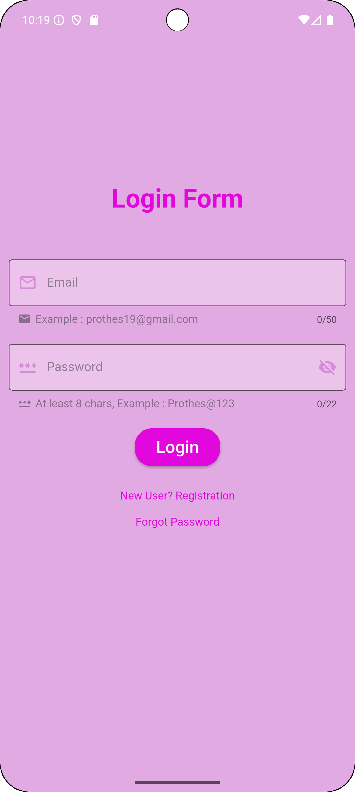
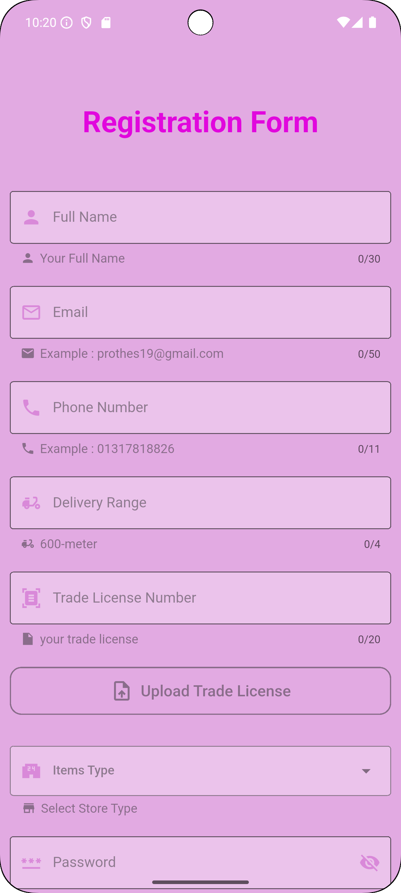
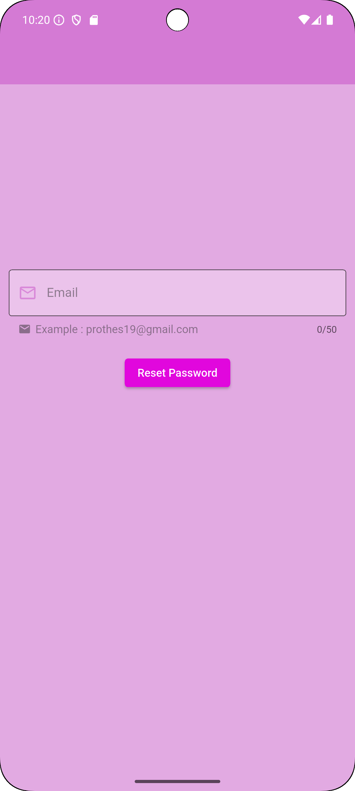
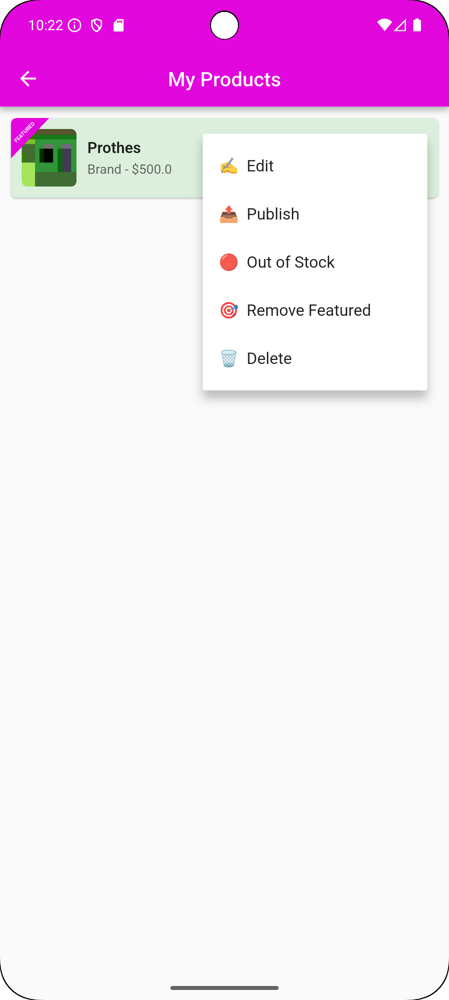
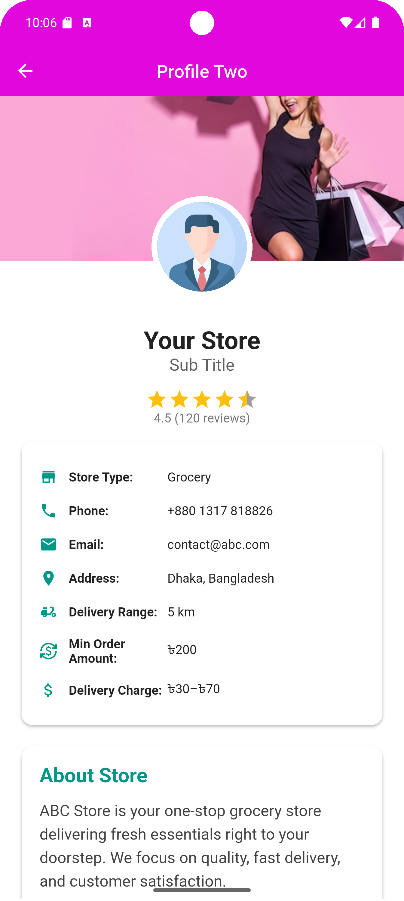

# 🛍️ Prothes Vendor Dashboard

A **Flutter-based Vendor Dashboard** application for managing vendor-side features of an e-commerce / marketplace system.

> 📦 **Repository:** `prothes_vendor-dashboard` — a cross-platform Flutter project (Android, iOS, Windows) containing the app code in `lib/` and platform folders (`android/`, `ios/`, `windows/`).

---


## 📸 Screenshots

<table>
  <tr>
    <td></td>
    <td></td>
    <td></td>
  </tr>
  <tr>
    <td></td>
    <td></td>
    <td></td>
  </tr>
  <tr>
    <td></td>
    <td></td>
    <td></td>
  </tr>
</table>

---

## 📖 Table of Contents

- [✨ About](#-about)
- [⚙️ Features](#️-features)
- [🧰 Prerequisites](#-prerequisites)
- [🚀 Setup & Run](#-setup--run)
- [📂 Project structure](#-project-structure)
- [📦 Dependencies](#-dependencies)
- [💡 Development tips](#-development-tips)
- [🧪 Testing](#-testing)
- [🤝 Contributing](#-contributing)
- [📜 License](#-license)

---

## ✨ About

This project provides a **vendor-facing dashboard** built with Flutter. It includes UI and logic to manage vendor activities (products, orders, analytics, profile, etc.). The repo contains platform folders for Android, iOS, and Windows and typical Flutter source code in `lib/`.

## ⚙️ Features (expected / typical)

- 📱 Cross-platform Flutter app (Android / iOS / Windows)
- 🔐 Vendor authentication and profile
- 🛒 Product listing and management
- 📦 Order list and status updates
- 📊 Dashboard / basic analytics
- 🌐 Multi-language (EN / BN)
- 🌙 Dark Mode
- 🎨 Uses Flutter packages for UI and networking

> 💬 *If you want me to list the exact implemented features from the codebase I can scan `lib/` and `pubspec.yaml` and add them automatically.*

## 🧰 Prerequisites

- 🧩 Flutter SDK (stable channel recommended). Minimum: Flutter 3.x or later (use `flutter --version` to check).
- 🧠 Dart (comes with Flutter).
- 🖥️ Android SDK / Xcode (if building for mobile).
- 💻 Optional: Visual Studio (for Windows target).

## 🚀 Setup & Run

1. **Clone the repository**

```bash
git clone https://github.com/prothesbarai/prothes_vendor-dashboard.git
cd prothes_vendor-dashboard
```

2. **Get packages**

```bash
flutter pub get
```

3. **Run the app**

- ▶️ For Android emulator / device:

```bash
flutter run
```

- 🪟 For Windows (if configured):

```bash
flutter run -d windows
```

4. **Common troubleshooting**

- ⚠️ If you see dependency errors:
  ```bash
  flutter pub cache repair
  flutter pub get
  ```
- 🔧 If platform build fails for Android, ensure `compileSdkVersion` and `minSdkVersion` in `android/app/build.gradle` match your Flutter version requirements.

## 📂 Project structure (high level)

```
/ (repo root)
├─ android/        # Android platform project
├─ ios/            # iOS platform project
├─ lib/            # Flutter/Dart source code (UI, pages, controllers)
├─ assets/         # Images, fonts, icons
├─ test/           # Unit & widget tests
├─ pubspec.yaml    # Packages & assets
└─ README.md
```

> 🧭 The `lib/` folder is the most important — it contains the app entrypoint, routing, pages, and business logic.

## 📦 Dependencies

Open `pubspec.yaml` to see current dependencies used by the project. Typical packages for this kind of app include:

- 🪶 `flutter` (SDK)
- 🌐 `http` or `dio` for networking
- 🧩 `provider` / `riverpod` / `get` for state management
- 💾 `shared_preferences` for local storage
- 🎨 UI helper packages (`flutter_svg`, `cached_network_image`)

> 📘 I can extract the exact list and pin versions into this README upon request.

## 💡 Development tips

- 🧹 Run `flutter analyze` to check for lint and analyzer issues.
- 🪄 Use `flutter format .` to keep code style consistent.
- ⚙️ Add `flutter_lints` and `.editorconfig` for team consistency.

## 🧪 Testing

Run unit & widget tests with:

```bash
flutter test
```

🧭 Add integration tests under `integration_test/` and run using `flutter drive` or `flutter test integration_test`.

## 🤝 Contributing

1. 🍴 Fork the repo
2. 🌱 Create a feature branch: `git checkout -b feat/your-feature`
3. 💾 Commit your changes and push
4. 🚀 Open a pull request with a clear description

🧠 Please include unit tests where appropriate and follow the existing code style.

## 📜 License

📝 Specify a license for the project (e.g. MIT). If you want, I can add a `LICENSE` file with your preferred license text.
